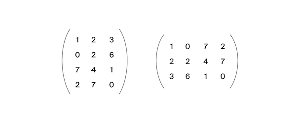

Alla has received an assignment related to monitoring the work of various servers. It is required to understand how long certain requests are processed on specific servers. This information should be stored in a matrix where the column number corresponds to the request ID and the row number corresponds to the server ID. Alla mixed up the rows and columns. It happens to everyone. Help her fix the bug.
There is a matrix of size m × n. We need to write a function that transposes it.
The transposed matrix is obtained from the original matrix by replacing rows by columns.
For example, for matrix A (on the left) the following matrix (on the right) will be transposed:

