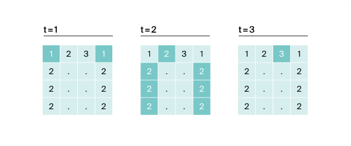

The game "Speed Typing Simulator" is a 4x4 field of keys, on which there is either a dot or a number from one to nine. The essence of the game is as follows: each round a combination of digits and dots appears on the field. At the moment of time t the player must simultaneously press all keys where there is a digit t.
If at time t all the necessary keys are pressed, the players get one point. If there are no keys with the digit t on the field, no winning point is awarded
Two players can press k keys each at one moment. Find the number of points that Gosha and Timofey can earn if they press the keys together. Consider example 1, in which k=3.

Let's assume that t=1. In this case, one player must press two keys with the number 1. To find out how many keys will be pressed by two players, let's use the formula: k*2. It turns out that together the boys will press six keys and get the winning point.
When t=2, two players need to press seven keys simultaneously. But this is not possible for the boys: each can press only three keys. No winning point is awarded.
When t=3, each player needs to press one button. Success! Now Gosha and Timofey have two winning points.
There are no other numbers on the field. Therefore, in the next rounds, where t=4...t=9, no victory points will be awarded. Thus, Gosha and Timofey will earn two points.
Find the number of points that Gosha and Timofey can earn if they press the keys together.
