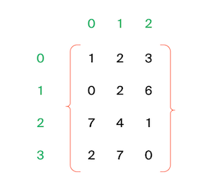

A matrix is given. You need to write a function that returns all its neighbors for an element. A neighbor is an element that is one cell to the left, right, up or down from the current one. Diagonal elements are not considered neighbors.
For example, in matrix A, the neighboring elements for (0, 0) are 2 and 0. And for (2, 1) -- 1, 2, 7, 7.

